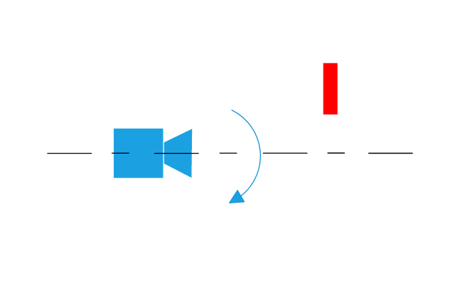
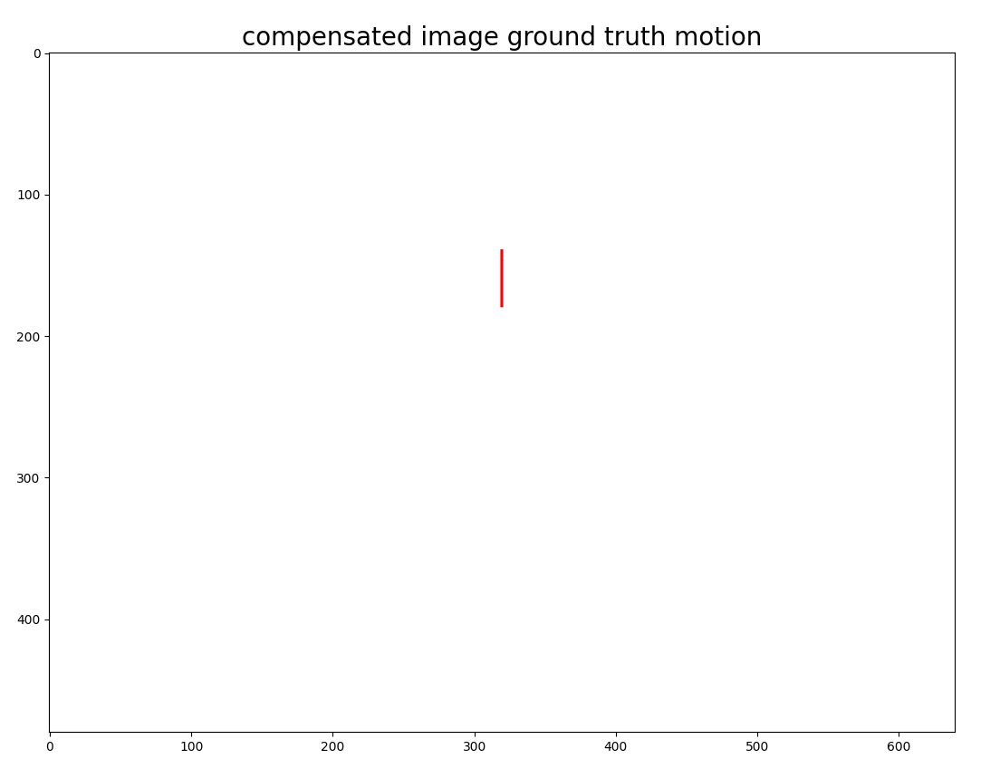

# Contrast Maximization

## What is contrast maximization?

Given a set of events obtained from the camera and/or scene motion, contrast maximization seeks to find the optimal
parameters of the motion underlying the generated events. The movement is modeled a-priori (shared by all events) and
defines the set of parameters to be optimized. Those parameters are optimized using non-linear optimization, which aims
at maximizing the contrast of the event image generated by warped events.

The image on the top shows a sample of an accumulated event image without motion compensation (left) versus an event
image after warping events using contrast maximization. Note that, assuming no brightness variation in the scene, each
event carries camera or scene motion information.

Examples of possible motions to be optimized are:

- Camera translational motion
- Camera rotational motion
- Full camera ego-motion (translation + depth)
- Optical flow
- Scene depth

Let's now explain the idea of contrast maximization more in detail for pure camera motion (i.e. static scene). The same
principles can be applied to a dynamic scene without loss of generality.

### Algorithm in details

Events will be generated by a static scene and a camera moving in space due to the camera motion. All events
corresponding to the same 3D point in the scene will fall at the same location in the pixels space. Taking a set of
events in a given time interval, if the camera's motion in this interval is perfectly known, it is possible to warp
events in space to a given previous point in time by applying the inverse of the camera motion. On the other hand, if
events are warped with incorrect motion, they will fall at different locations. Based on this simple idea, it is
possible to build an objective function that estimates the motion estimate's goodness by analyzing warped events. This
is done by measuring the sharpness of the event image generated by warping events with the assumed camera motion.

#### What is contrast?

Since the algorithm's name is contrast maximization, it is important to understand where the name comes from. Indeed,
the contrast is the value of the cost function used in the optimization. The contrast of the event image corresponds to
computing its variance. If the events are warped with the wrong motion assumption, they will fall at random locations on
the image plane. Assuming enough events, there will be at least one event per pixel in the image plane in the extreme
case. In this case, the contrast of the image will be 0. On the other hand, if an event image has strong edges, the
contrast will be high. Because event-cameras detect edges, it is reasonable to find the camera motion by warping events
such that those edges are "reconstructed" at a specific time.

To understand this principle, below you can find an example of how contrast maximization would work far a rotating
camera in front of a static bar.

## Example: static bar - rotating camera

To understand the basic principle of contrast maximization, we use a simple scene composed of a static bar and a camera
pointing to it. We assume the camera motion is defined by a pure rotation around its optical axis. As long as the camera
is not moving, no event is generated. The image below shows the example setup viewed from the side.

An x-axis point defines the camera coordinate system to the right, the y-axis to the bottom and the z-axis pointing in
front. Once the camera starts rotating at constant speed *ωcamera* (this value is not known) around its
optical axis, events due to the relative motion between the static bar and the camera will be generated on the image
plane. By reconstructing the event image corresponding to the accumulated events, we would get an image similar to the
one on the bottom.

Now we explain how to estimate the camera speed *ωcamera* from the event set *Et0-t1* generated in
the time interval between *t0* and *t1*. Select motion model used to explain generated events. We
assume the camera to rotate only. The camera motion is defined by a pure rotation *ωk* = \[*ωx*,
\* ω y\*,*ω z*\]. Since the camera rotate only around its optical axis we set *ωx = 0*,
*ωy = 0* and optimize only *ωx*, *ωz* value.

Here is a pseudocode of the non-linear optimization to be solved:

- Solve for *ωopt* by maximizing variance.
- While (not_converged):
  - current camera speed guess: *ωk*
  - for each event *ei== \[xi, yi, poli, ti\]*:
    - compute the total camera motion between t0 and ti as: θz = *ωz*(k)
      - (t i - t0). Since the camera rotate only along z axis, it implies θ = \[0, 0,
        θz\]
    - get equivalent camera rotation matrix R defined by θ.
    - warp event *ei* to time t0 using  
         where K is che camera intrinsic
      matrix, R is camera rotation matrix defined by θ and pt(i) = \[xi, yi, 1\].
  - Get set of warped events Ewarped, representing all events warped at time t0.
  - Compute event image from Ewarped.
  - Compute variance of event image

Usually, the camera motion is defined by a 4x4 transformation. In this case, since a pure rotational model is assumed,
we neglect the translational part. Because of this, the whole camera motion can be defined by a 3x3 matrix representing
the camera rotation.

At each iteration, if the value of *ωk* is close to *ωcamera* events will be warped in such a way
that the event image will be similar to the image below. Vice versa, if the value of *ωk* is far from *ω
camera*, then the events will not fall along the vertical bar, and the generated event image will have lower
contrast. The non-linear optimization computes the gradient by evaluating multiple event images at time *k*, and this
gradient is then used to update the camera speed for the next iteration. If the algorithm converges correctly (i.e.
ωopt~ωcamera), the resulting image will be similar to the one shown on the bottom.

 Note that the algorithm rarely converges to the exact
motion underlying the generated events. In most cases, the results will be very close to the ground truth motion (if the
initialization of the parameters to be optimized is good enough). For completeness, the image at the bottom shows the
compensated image assuming perfect motion from the camera is known. As you can see, all events converge to the same
vertical line when motion is compensated with ground truth motion.

### Summary: algorithm steps

In summary, the steps of the contrast maximization algorithm for a given motion model are the following:

1. Warp events according to the trajectories defined by the model and its model parameters.
1. Generate event image from warped events.
1. Compute score based on the image of warped events.
1. Optimize score for model parameters.

#### Importance of initial guess

Since contrast maximization is based on a non-linear optimization, the initial guess for the parameters to be optimized
has a substantial impact on the accuracy of the final optimization. If the initial guess is very different from the
proper motion, the non-linear optimization will most likely end in a local minimum or converge to unexpected results.

## Usage of available implementation

The contrast maximization algorithm is available in C++.

There are two sample usages. The first one can be found at
`samples/motion-compensation-samples/contrast_maximization_rotation.cpp`: the gyroscope offsets along x, y, and z are
optimized in this sample. The second one can be found at
`samples/motion-compensation-samples/contrast_maximization_translation_depth.cpp`: here, the camera translation alone on
the three-axis is optimized, together with scene depth.

It is possible to run the code `samples/motion-compensation-samples/contrast_maximization_translation_depth.cpp` using a
sample recording that can be downloaded from
https://s3.eu-central-1.amazonaws.com/release.inivation.com/datasets/translation_tunnel_sideways.aedat4. The code can be
run by passing as argument the path to the downloaded aedat4 file, the path of the corresponding calibration file that
can be found in /docs/source/assets/contrast_maximization/calibration.json and as initial translation and depth guesses:

*depth = 2*, *translation = \[-0.12, 0.0, 0.0\]*.

More information about the two samples can be found in the code.

## Limitations

This algorithm is very powerful, but at the same time, it has some inherent limitations that need to be taken into
account.

#### Wrong motion model

The results would not be very accurate if the motion model assumed differs from the underlying motion that generates the
event set. This can be the case if multiple motions are present in the scene (e.g., camera motion + dynamic scene). It
would be necessary to first cluster events into separate groups based on similar motion and then apply contrast
maximization on each event set separately.

#### Too complex optimization

Another possible cause that might lead to incorrect results is the case in which the optimization is too complex. For
example, optimizing both camera rotation and translation simultaneously will create a vast search space for the
optimization. The optimization result might degenerate into an unexpected output that does not consider the scene's
geometry.

#### Events not generated by motion

Contrast maximization assumes all events generated by motion, either from the camera or from the scene. However, suppose
events are generated from brightness change. Contrast maximization will try to explain those events with some motion,
even if events are caused by brightness change and not movement. Due to this, the optimization will converge to
unexpected results.
