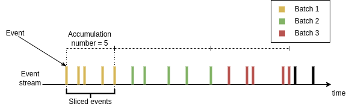
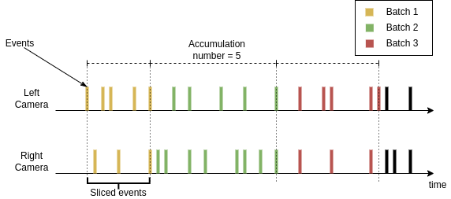

# Event stream slicing

Events are a sparse representation for brightness changes registered by an event camera. It is useful to group incoming
events from a stream in certain time-windows or by a certain number. The dv-processing library provides an efficient,
yet powerful tools to approach continuous slicing of events. Following chapters will provide samples on how to use
available event stream slicer implementations to group events in specific batches.

## EventStreamSlicer

{cpp:type}`dv::EventStreamSlicer` implements event slicing for a single event stream. Incoming events are passed into
the slicer using the `accept()` method, the underlying implementation applies required slicing approach and resulting
sliced events are passed into registered callback methods. The slicing can be performed using fixed size time-windows or
fixed size number of events. According callback function can be registered using
{cpp:func}`dv::EventStreamSlicer::doEveryNumberOfEvents()` or {cpp:func}`dv::EventStreamSlicer::doEveryTimeInterval()`
methods. The registered callbacks and their calling parameters can also be modified later on.

The approach can be visualized by looking at a stream of events coming from a camera as a time series. The slicing can
be performed by splitting the stream by a fixed time window as shown in a diagram below:


The other approach is to slice by a fixed number of events instead, as shown in the diagram below:



### Slicing a stream

Following sample shows how to perform time-based slicing of an event stream:

`````{tabs}
````{group-tab} C++
```{literalinclude} assets/code_samples/c++/event_stream_slicing/sample0.cpp
:language: c++
:linenos:
:tab-width: 4
```
````

````{group-tab} Python
```{literalinclude} assets/code_samples/python/event_stream_slicing/sample0.py
:language: python
:linenos:
:tab-width: 4
```
````
`````

### Modifying slicing parameters

Slicing parameters can also be modified during runtime if needed. Following code sample is a modified version of the
sample from previous chapter, which shows how to use the parameter modification methods:

`````{tabs}
````{group-tab} C++
```{literalinclude} assets/code_samples/c++/event_stream_slicing/sample1.cpp
:language: c++
:linenos:
:tab-width: 4
```
````

````{group-tab} Python
```{literalinclude} assets/code_samples/python/event_stream_slicing/sample1.py
:language: python
:linenos:
:tab-width: 4
```
````
`````

## Stereo stream slicer

A dual stream slicer is required to perform synchronized time slicing from a stereo camera setup. This is implemented in
the {cpp:type}`dv::StereoEventStreamSlicer` class. It implements stereo event stream slicing by applying regular stream
slicing on one of the input streams and performing time-based slicing within the same time-window. An illustration of
the approach for slicing by time is displayed below:


Since the input data can be coming at different rates, in case of slicing by number, the according event from right
camera are selected within the same time window. This case is shown below:



In the image above, the slicer is assumed to have a setting to slice every 5 events, these events are sliced from the
left camera and their exact timestamps are used to slice events from the right camera.

A sample code on how to use stereo event stream slicer with a live camera is shown below:

`````{tabs}
````{group-tab} C++
```{literalinclude} assets/code_samples/c++/event_stream_slicing/sample2.cpp
:language: c++
:linenos:
:tab-width: 4
```
````

````{group-tab} Python
```{literalinclude} assets/code_samples/python/event_stream_slicing/sample2.py
:language: python
:linenos:
:tab-width: 4
```
````
`````

## Generic data stream slicing

Event stream slicers described previously are intended for efficient and specific slicing approach to event stream data.
The dv-processing library also provides a generic time-series data stream slicer class
{cpp:class}`dv::MultiStreamSlicer` that applies the same approach, but supports arbitrary number of streams and
arbitrary data-types. The only requirement for data types is the timestamp data, that can be accessed through a
predefined API. The predefined API requirement is implemented using C++20 concepts and templates, so the requirement can
be satisfied by any type that can provide a microsecond timestamp expressed in a signed 64-bit integer.

The {cpp:class}`dv::MultiStreamSlicer` class provides same slicing capabilities with methods allowing to slice by time
{cpp:func}`dv::MultiStreamSlicer::doEveryTimeInterval` or by number
{cpp:func}`dv::MultiStreamSlicer::doEveryNumberOfElements`. Since the {cpp:class}`dv::MultiStreamSlicer` supports an
arbitrary number of streams, the streams are managed by assigning a unique string name to each stream by using the
{cpp:func}`dv::MultiStreamSlicer::addStream()` method. By default, the slicer accepts the timestamped data types from
the DV flatbuffer type system, such as: {cpp:class}`dv::EventPacket`, {cpp:class}`dv::IMUPacket`, and other packet data
types. If a data type is provided without a container, it can be used with STL containers, such as `std::vector` or
dv-processing provided {cpp:class}`dv::cvector`. In a case an image frame {cpp:class}`dv::Frame` stream needs to be
sliced, it has to be wrapped in a container, e.g. using {cpp:class}`dv::cvector`: `dv::cvector<dv::Frame>`. Such a
contained and timestamped data can be sliced alongside other data type streams.

To be clear about how the {cpp:class}`MultiStreamSlicer` manages data slicing, it uses a convention of "main stream" and
"secondary streams". Main stream is declared in the constructor of the class and all other stream are added using the
{cpp:func}`MultiStreamSlicer::addStream()` method. The main stream is the driving data stream slicing; while secondary
streams are following the time-ranges that are sliced from the main stream, similar to how
{cpp:type}`dv::StereoEventStreamSlicer` works.

Following sample shows the use of the {cpp:class}`MultiStreamSlicer` to synchronously slice incoming frame and event
streams from a DAVIS346 camera and show a preview. The preview below

```{literalinclude} assets/code_samples/c++/event_stream_slicing/sample3.cpp
---
language: c++
linenos:
tab-width: 4
---
```

```{figure} assets/event_stream_slicing/multi_stream_slicing.png
---
align: center
---
Output from the multi stream sample usage - frames with synchronized events overlayed in the frame image.
```

The multi stream slicer is also available in python, but due to missing template functionality in python, the python
version is more limited. `dv.EventMultiStreamSlicer` class is provided in python, which only supports events as main
stream and has slightly different API, but it supports arbitrary number of secondary streams, which can be of any type
that is built-in in dv-processing. Secondary streams can be added using named methods for types.

The example below shows the use of the multi-stream slicer in python which uses events as main stream and slices frames
as secondary stream:

```{literalinclude} assets/code_samples/python/event_stream_slicing/sample3.py
---
language: python
linenos:
tab-width: 4
---
```

This sample will result in similar output to the C++ version, but it rather synchronizes events to frames, so output of
the samples are comparable, but not exact.
