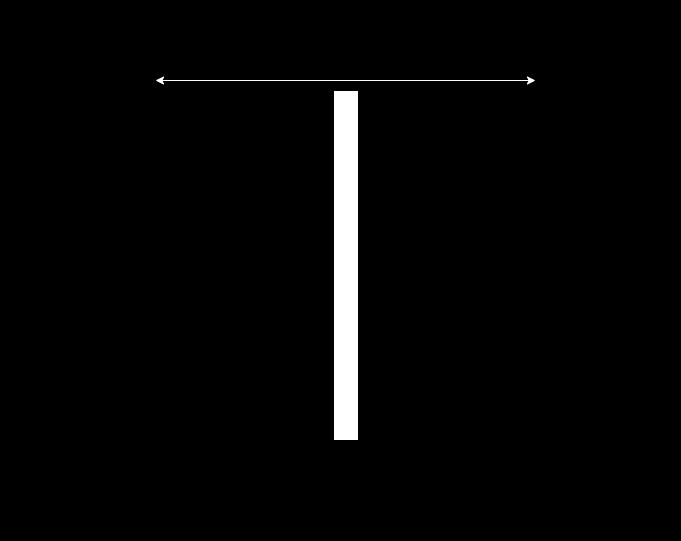
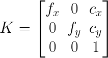
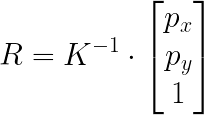
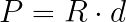
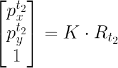

# Motion Compensation

## What is the motion compensation algorithm?

An algorithm to align events in a stream to produce sharp images of edges. Due to camera motion, the events are
distributed within the pixel space of a moving camera sensor. If the camera geometry (calibration) and camera motion is
known, the camera motion can be applied to the incoming events, so the event locations align to same pixel locations
over time.

## Visual explanation

Let's discuss a scenario where a white rectangle is moving at a constant speed on a white background. Let's say it's
only moving back-and-forth within the X dimension (image below):

The motion of the rectangle will generate events over time. In the direction of motion the rectangle will generate ON
events at the front of rectangle and OFF events at the opposite side. Let's ignore the Y axis and let's look at the
event stream from Y axis perspective (given Z axis is time) at the image below.

So the events come in at a slope, so if we accumulate the slice of events they will be represented as a thicker band of
ON and OFF events instead of seeing the corresponding edge. This happens due to the fact that the motion happened over
time and event the motion within time-slice is accumulated.

A way to correct this would be to move the camera "virtually" in same direction and speed. This would cause the events
to align and be represented at the same pixel location on the sensor (see image below, for simplicity it shows only the
ON events aligned).

This is just a scenario to imagine on the concept itself. Usual application case would be when the environment of the
camera is static and only the camera moves. If we know the camera motion, we can apply the known motion to the received
event coordinate to match the camera motion. In that case the algorithm reverses the problem, assumes the camera is
stationary at a single point in time and aligns measured events to happen at the same pixel location in the sensor at a
given perspective.

## Details of the implementation

Motion compensation applies measured motion of the camera to the event stream. The approach doesn't cover how the motion
is estimated: it can be either some external sensor (e.g. IMU) or visual odometry system estimating camera ego-motion,
these measurements are assumed to be known by the algorithm.

### Camera geometry

To apply known motion of the camera, firstly event pixel coordinates must be represented in a 3D space. This is
performed using camera geometry and back-projection. Back-projection is performed to find a pixel coordinate ray that
maps pixel coordinates into a flat 3D plane in front of the camera, that is one-meter away from the focal point.

Camera matrix (K in the formula below) contains focal length (fx, fy) and principal point (cx, cy) coordinates retrieved
from calibration of the camera sensor.

Back-projection can be achieved by multiplying pixel coordinate homogenous representation of \[px, py, 1.0\] multiplied
(px and py are the pixel coordinates on the sensor) by the inverse of the camera matrix.

This estimated ray (R) can be multiplied by an estimated depth distance (d) to the scene provide a reasonable estimate
of the actual 3D position that cause the pixel to generate an event (let's call it P). If the distance to the scene is
not known, a guess of 3 meters is usually a good enough estimate.

### Kinematics (applying the motion)

Let's denote a transformation matrix that describes a motion in 3D, 4x4 matrix containing a 3x3 rotation matrix and 3x1
translation vector.

By multiplying a 3D point P (that was captured at time t1) by the matrix that describes camera motion between
time-points t1 and t2, we can estimate the position of the object at camera perspective t2.

The resulting point at t2 can be normalized by the Z axis (X, Y, and Z components divided by Z) results in a projection
at one meter plane.

which can be projected into pixel frame by multiplying the point by camera matrix K, thus aligning the pixel coordinates
in space.

## Usage of available implementation

The motion compensation algorithm is available in C++ and Python.

A sample usage of the motion compensator can be found in `samples/motion-compensation-samples/imu_compensation.cpp`. In
this sample, measurement from a gyroscope are concatenated to estimate camera rotational motion, this information is
then used to reduce motion blur induced by the camera motion.
